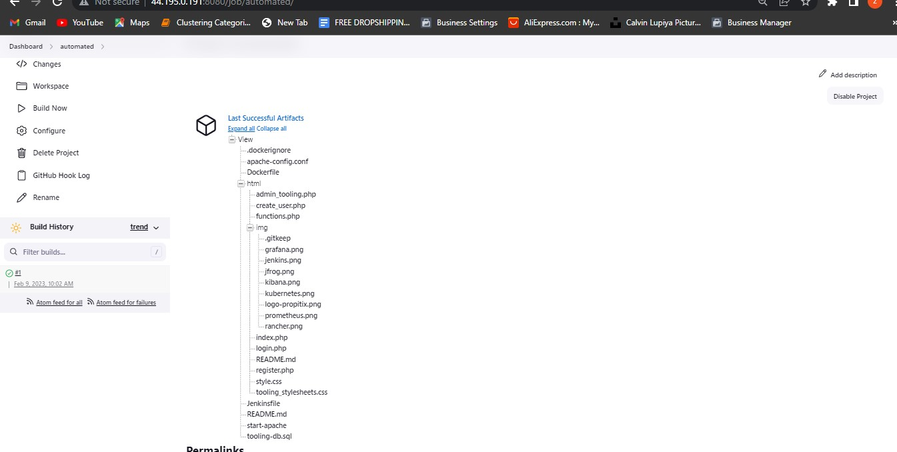
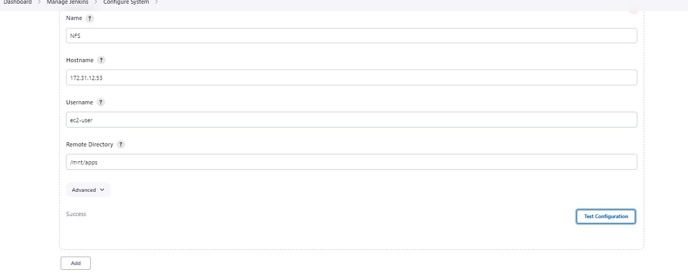

### Install Jenkins
```
Install JDK

sudo apt update

sudo apt install default-jdk-headless

Install Jenkins

wget -q -O - https://pkg.jenkins.io/debian-stable/jenkins.io.key | sudo apt-key add -
sudo sh -c 'echo deb https://pkg.jenkins.io/debian-stable binary/ > \
    /etc/apt/sources.list.d/jenkins.list'

sudo apt update

sudo apt-get install jenkins
```
#### Ensure Jenkins is running 
`sudo systemctl status jenkins`

### Open TCP port 8080 as that is the jenkins default port

### Log into jenkins


###  Configure Jenkins to retrieve source codes from GitHub using Webhooks

### Enable webhook in yout github repo


### Go to your jenins console and select new item


### Enter a new item/job name and choose freestyle project


### In your job configuration, choose git repository and provide the link to your tooling website repo and add credentials


### Continure your configuration, in the "Build Triggers" section select Github hook trigger for GITScm polling


### Proceed to the "Post Build Actions" section and here select the "archive all files" option.


### Save your configuration. Go ahead and make little changes to the README.md file of your tooling website repo and push to the masters branch and your build shold be automatically triggered.


### Check your jenkins console for automatic builds and for artifacts




### check to see the artifacts stored locally


### Configure jenkins to copy files to NFS server via SSH
### First install the publish over ssh plugin


### Configure the plugin, on your dashboard select "manage plugins" -> "configure system" -> scroll down to the "publish over ssh" section and configure it to connect to the NFS server

- Provide a private key (content of .pem file that you use to connect to NFS server via SSH/Putty)
- Arbitrary name
- Hostname – can be private IP address of your NFS server
- Username – ec2-user (since NFS server is based on EC2 with RHEL 8)
- Remote directory – /mnt/apps since our Web Servers use it as a mounting point to retrieve files from the NFS server 


### Test the configuration to make sure it returns as "success"



### Return to your last job and edit the configuration, go to "add post build acton section" and add "publish over ssh". Select the "send build artifacts over ssh" option


### Configure it to send all files probuced by the build into our previouslys defined remote directory


### Check the remote directory before the build and transfer is triiggered


### Set permissions on the remote dierectory where the artifacts will be sent

`sudo chmod -R 777 /mnt`

`sudo chown -R nobody:nobody /mnt`


### Trigger the build


